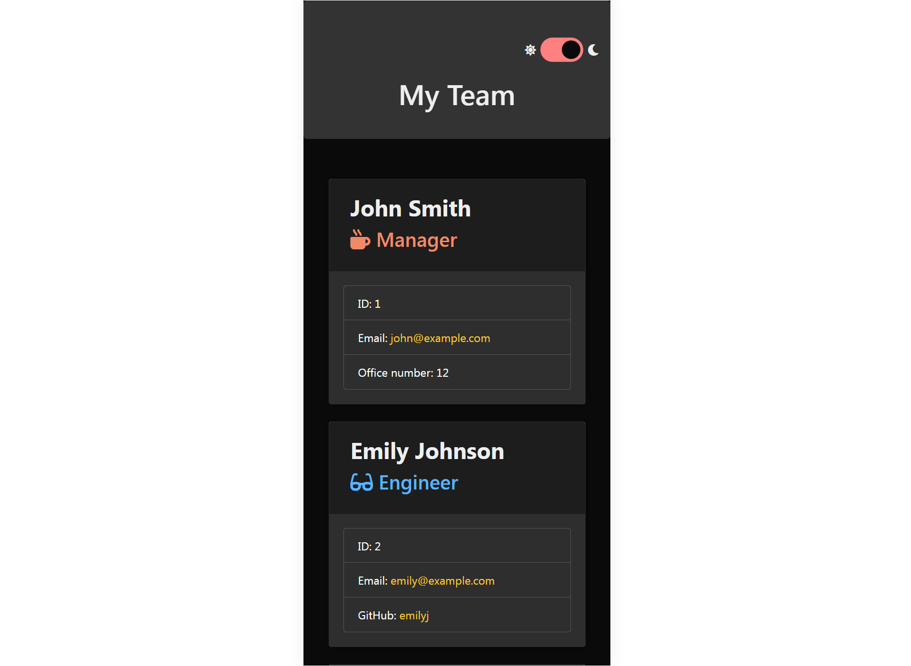

# W12-TeamProfilerJS

## Description

This is a command-line application that helps users create an HTML page to display information about their team members. The app prompts users to input details of Managers, Engineers, and Interns for each team member. The generated HTML page is stylized using Bootstrap and includes a light and dark theme switcher.

## Table of Contents

- [Installation](#installation)
- [Usage](#usage)
- [Generated HTML](#generated)
- [License](#license)
- [Features](#features)
- [Reference](#reference)
- [Questions](#questions)

## Installation

Follow these steps to install the Dynamic README Generator:

1. Clone the repository.
   <a href="https://github.com/celia103/W12-TeamProfilerJS" target="_blank">The URL of the GitHub repository</a>
2. Run 'npm install' to install dependencies.

## Usage

1. Once installed, run the application using the command 'node index.js' in the terminal.
2. Follow the prompts to input information about each team member. Choose the role (Manager, Engineer, Intern) and provide the relevant details.
   
3. Repeat the process to add as many team members as needed.
   
4. Select the "Finish" option when you have added all team members. The application will generate an HTML file in the output directory.
   

## Generated

The generated HTML file (output/team.html) contains a stylized representation of the team, with each member's details displayed in separate cards. The page is responsive and includes a light/dark theme switcher for user preference.
The sample HTML file generated using this application:
<a href="https://celia103.github.io/W12-TeamProfilerJS/output/team.html" target="_blank">https://celia103.github.io/W12-TeamProfilerJS/output/team.html</a>

- Light theme (Website version)
  
- Light theme (mobile version)
  
- Dark theme (Website version)
  
- Dark theme (mobile version)
  

## License

MIT License

## Features

1. **Interactive Command-Line Interface:** Use an easy-to-use command-line interface to create a team profile based on user input.

2. **Customizable Profiles:** Add team roles and customize each team member's profile with name, employee ID, email, and role-specific details for a tailored representation.

3. **Stylized HTML Output:** Generate a visually appealing HTML page that presents your team's details, suitable for immediate use in your project documentation.

4. **Responsive Design:** Ensure a seamless experience on different devices with a responsive design that adjusts to various screen sizes.

5. **Light/Dark Theme Switcher:** Customize the generated HTML page with a light/dark theme switcher, enhancing user experience.

## Reference

- **For Light/Dark Theme Switcher:**
  <a href=" https://dev.to/ananyaneogi/create-a-dark-light-mode-switch-with-css-variables-34l8
  " target="_blank"> https://dev.to/ananyaneogi/create-a-dark-light-mode-switch-with-css-variables-34l8
  </a>

## Questions

If you have any questions or need further clarification, feel free to open an issue or contact directly:

- <a href="mailto:celiayych@gmail.com" target="_blank">Celia's Email</a>
